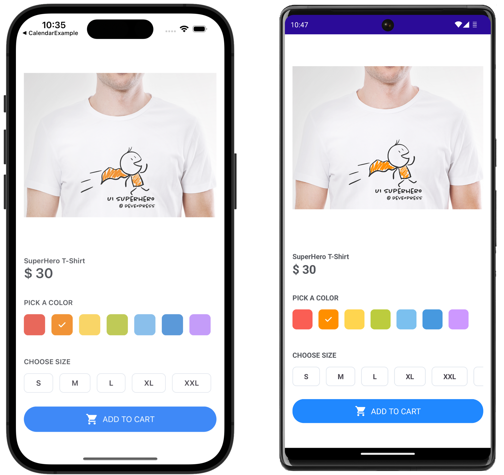

<!-- default badges list -->

<!-- default badges end -->
# DevExpress Chips for .NET MAUI 

[DevExpress Mobile UI](https://www.devexpress.com/maui/) allows you to use a .NET cross-platform UI toolkit and C# to build native apps for iOS and Android.

The **DevExpress Mobile UI for Xamarin.Forms and .NET MAUI** is free of charge. To learn more about our offer and to reserve your copy, please visit [Free DevExpress Mobile UI for Xamarin.Forms and .NET MAUI](https://www.devexpress.com/xamarin-free).

## Requirements

Register the DevExpress NuGet Gallery in Visual Studio to restore the NuGet packages used in this solution. See the following topic for more information: [Get Started with DevExpress Mobile UI for .NET MAUI](https://docs.devexpress.com/MAUI/403249/get-started).

You can also refer to the following YouTube video for more information on how to get started with the DevExpress .NET MAUI Controls: [Setting up a .NET MAUI Project](https://www.youtube.com/watch?v=juJvl5UicIQ).

## What's in This Repository

A demo application in this repository allows you to get started with chips &#8212; controls that display information in a discrete and compact form. They allow users to make selections, filter content, or trigger actions. The following chip types are supported:
 
* [Action Chips](https://docs.devexpress.com/MAUI/DevExpress.Maui.Editors.Chip) are like compact buttons and allow users to invoke an action related to primary content. An action chip may be used to display documents attached to emails.
* [Filter Chips](https://docs.devexpress.com/MAUI/DevExpress.Maui.Editors.FilterChipGroup) allow users to select multiple options from a set. You can use filter chips to replace toggle buttons/checkboxes or use filter chips to display filters applied to content.
* [Choice Chips](https://docs.devexpress.com/MAUI/DevExpress.Maui.Editors.ChoiceChipGroup) allow users to select a single option from a set. These chips are best used when only one choice is possible. For example, use choice chips to select the size of an item placed in a shopping cart. Choice chips can be a good alternative to radio buttons and combo boxes.
* [Input Chips](https://docs.devexpress.com/MAUI/DevExpress.Maui.Editors.InputChipGroup) display user input as a single piece of information (may be validated, deleted, or modified). Input chips can be used to enter entities like places, activities, roles, or used to enter tags or email addresses.

## Documentation

- [Data Grid](https://docs.devexpress.com/MAUI/403255/data-grid/data-grid)
- [Charts](https://docs.devexpress.com/MAUI/403300/charts/charts)
- [Data Form](https://docs.devexpress.com/MAUI/403640/data-form)
- [Navigation](https://docs.devexpress.com/MAUI/403297/navigation/index)
- [Data Editors](https://docs.devexpress.com/MAUI/403427/editors/index)
- [Collection View](https://docs.devexpress.com/MAUI/403324/collection-view/index)

## More Examples

* [Stocks App](https://github.com/DevExpress-Examples/maui-stocks-mini)
* [Data Grid](https://github.com/DevExpress-Examples/maui-data-grid-get-started)
* [Data Form](https://github.com/DevExpress-Examples/maui-data-form-get-started)
* [Data Editors](https://github.com/DevExpress-Examples/maui-editors-get-started)
* [Charts](https://github.com/DevExpress-Examples/maui-charts)
* [Scheduler](https://github.com/DevExpress-Examples/maui-scheduler-get-started)
* [Tab Page](https://github.com/DevExpress-Examples/maui-tab-page-get-started)
* [Tab View](https://github.com/DevExpress-Examples/maui-tab-view-get-started)
* [Drawer Page](https://github.com/DevExpress-Examples/maui-drawer-page-get-started)
* [Drawer View](https://github.com/DevExpress-Examples/maui-drawer-view-get-started)
* [Collection View](https://github.com/DevExpress-Examples/maui-collection-view-get-started)
* [Popup](https://github.com/DevExpress-Examples/maui-popup-get-started)
